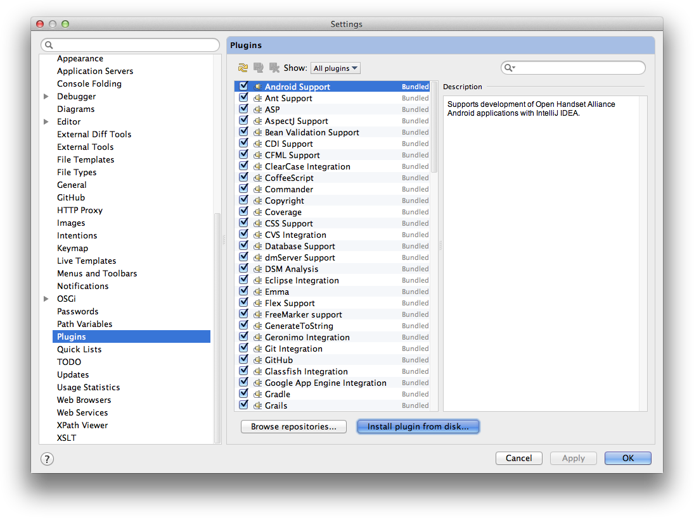
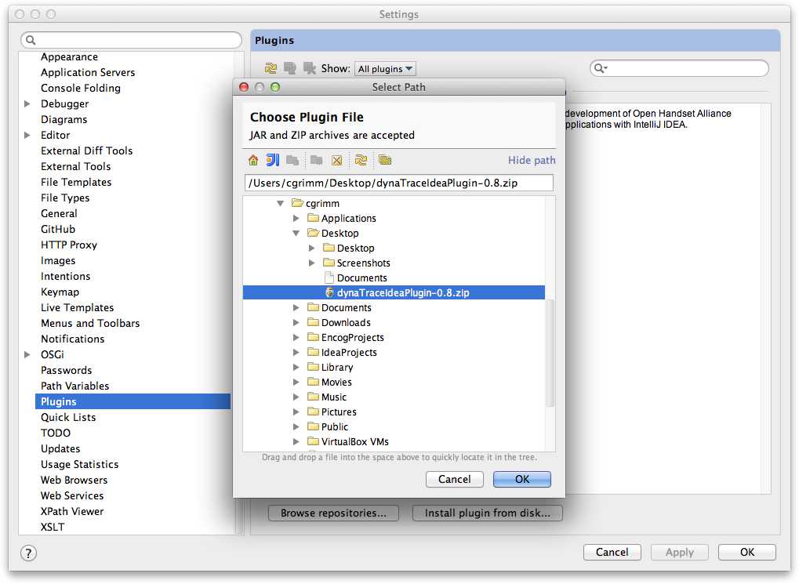
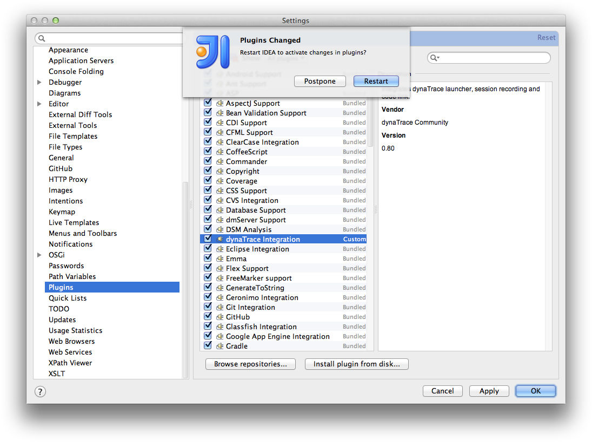
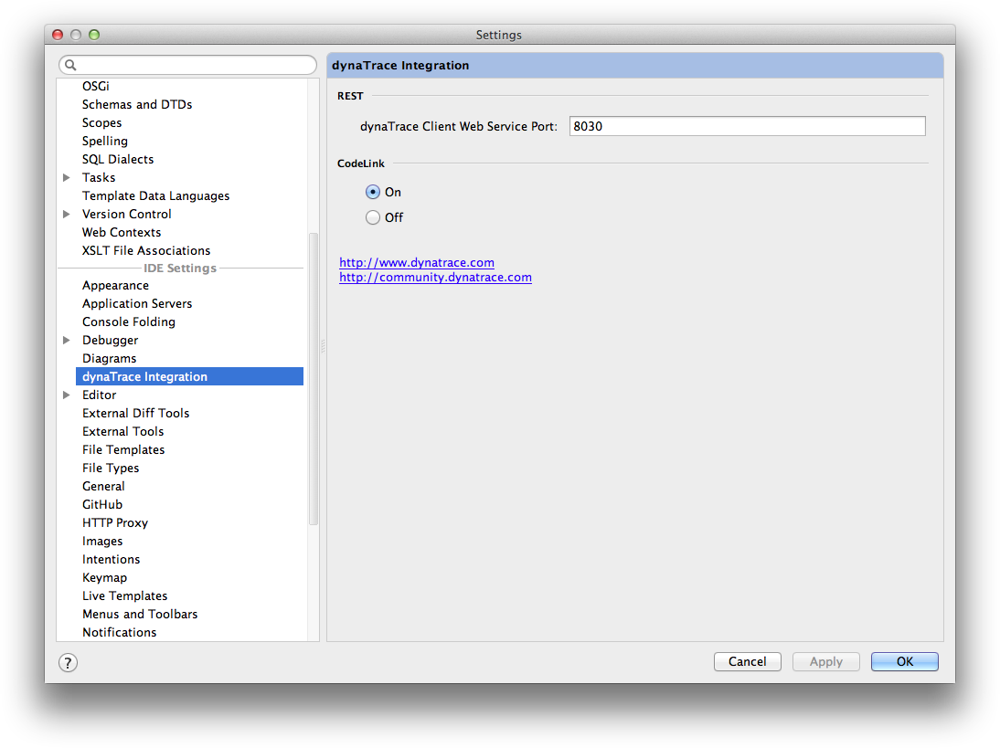
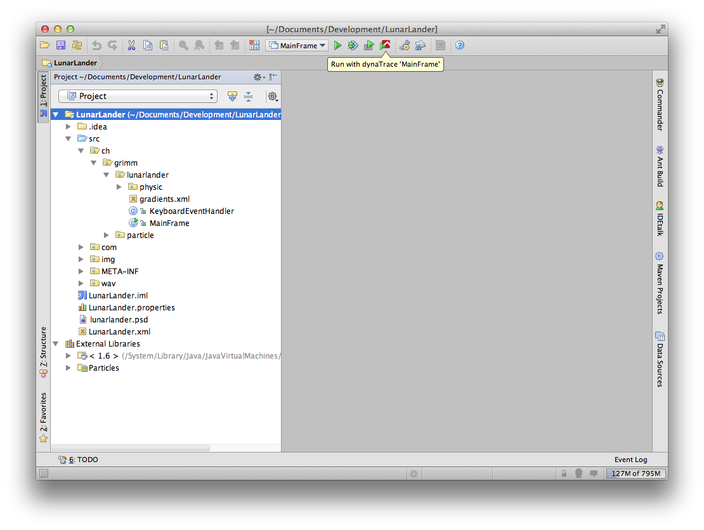
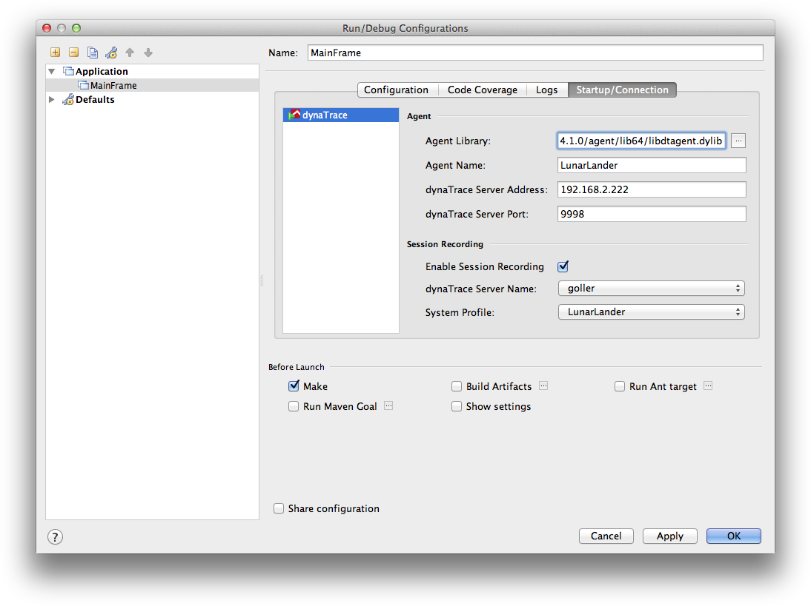
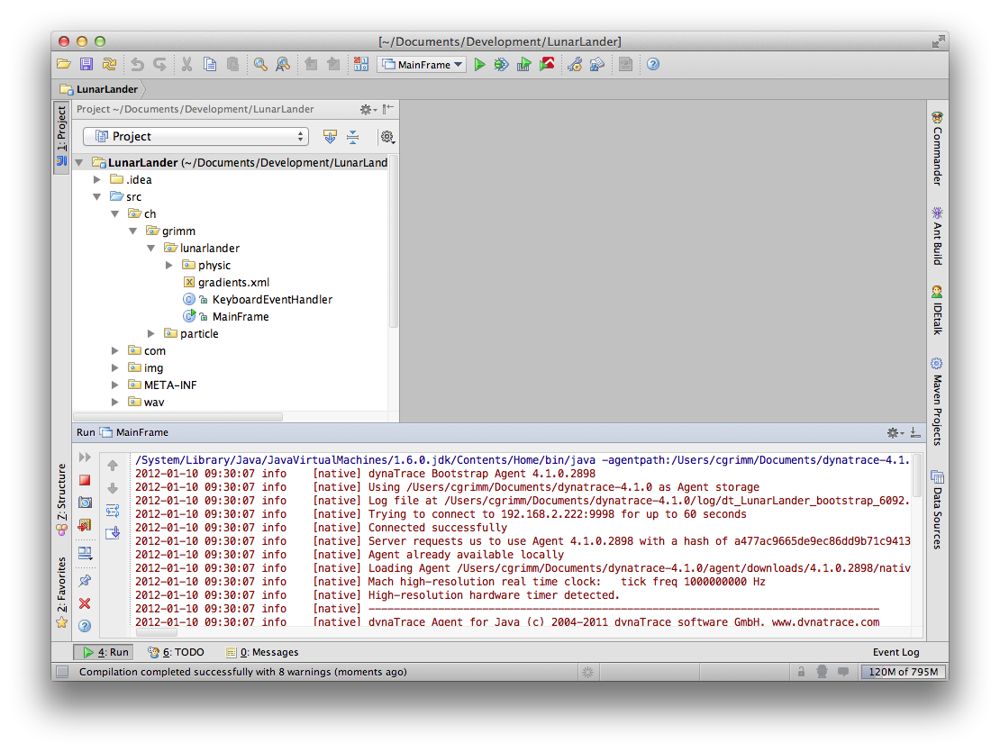
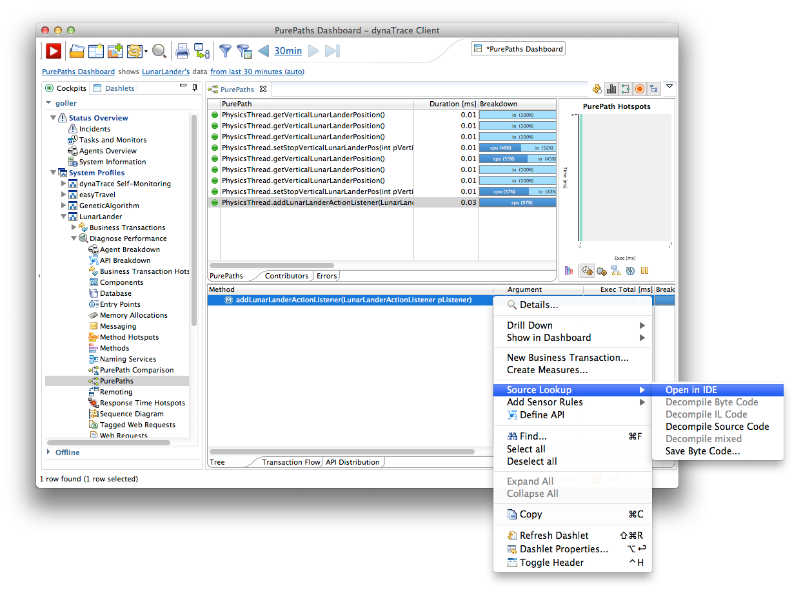
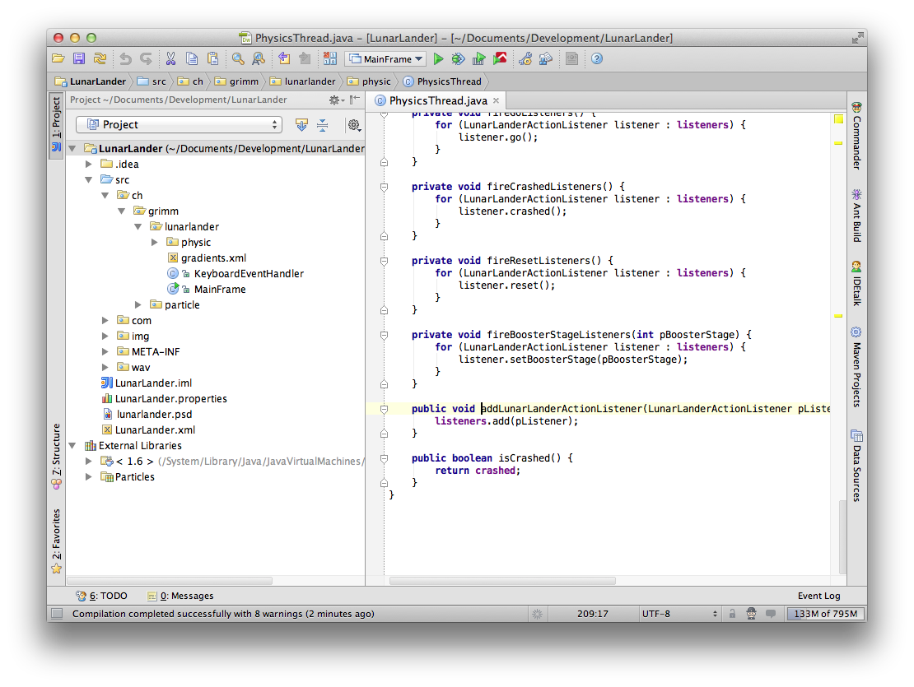

# dynaTrace IntelliJ IDEA Integration Plugin

Special Thanks to Christian Grimm who contributed this plugin to the dynaTrace Community

## Overview

The IntelliJ IDEA Plugin integrates dynaTrace advanced profiling capabilities to the [IntelliJ IDEA IDE](http://www.jetbrains.com/idea/). The plugin uses the IDEA plugin architecture and integrates
seamless. All configurations can be done by using the graphical user interface.

The following dynaTrace integrations are supported:

  * Agent Injection (Launcher) 

  * Session Recording 

  * Source Code Lookup (CodeLink) 

## Plugin Details

| Name | dynaTrace IntelliJ IDEA Integration Plugin
| :--- | :---
| Author | Christian Grimm (christian.grimm@dynatrace.com)
| Supported dynaTrace Versions | >= 5.5
| Suppported IntelliJ IDEA Versions | 11.0 (Tested)  
| | 10.0 (Tested)  
| | 8.0 - 9.0 (Should be API compatible with 10.0 version, NOT tested)
| License | [dynaTrace BSD](dynaTraceBSD.txt)
| Support | [Not Supported](https://community.compuwareapm.com/community/display/DL/Support+Levels)
| Release History | 2012-01-10 Initial Release  
|| 2012-03-15 Added support for older IDEA 10.0 version
| Download | IDEA 11.0: [dynaTraceIdea11Plugin-0.8.zip](dynaTraceIdea11Plugin-0.8.zip)  
| | IDEA 10.0: [dynaTraceIdea10Plugin-0.8.zip](dynaTraceIdea10Plugin-0.8.zip)

## Installation

The following process describes how to install the dynaTrace IntelliJ IDEA Plugin on a MacOS system. However, the process is identical on other operating systems.

### Step 1 - Download

Download the plugin ([dynaTraceIdea10Plugin-0.8.zip](dynaTraceIdea10Plugin-0.8.zip) or [dynaTraceIdea11Plugin-0.8.zip](dynaTraceIdea11Plugin-0.8.zip)). Do
not unzip it, IDEA will do this for you.

### Step 2 - Installation

Open the IDEA general preferences dialog, navigate to "Plugins" and click on "Install plugin from disk..":  

Select the downloaded .zip file:  

After the plugin has been successfully installed, a restart of IDEA is required:  

## Usage

The dynaTrace IDEA plugin provides two configuration dialogs:

### IDE Settings

The dynaTrace settings dialog can be access by opening the IDEA preferences dialog and navigating to the "dynaTrace Integration" section:  
  
There are two settings here:

  * dynaTrace Client Web Service Port: This specifies the TCP port used to connect to the dynaTrace client's REST services. 

  * CodeLink: If enabled, IDEA connects to the local dynaTrace client using the specified TCP port. This enables the context menu "Source Lookup" -> "Open in IDE" in the dynaTrace client and opens the selected class/method in IDEA. 

### Launcher

This dynaTrace launcher is located in the IDEA main window right next to the standard 'Run' button:  

Before the 'Run with dynaTrace' button can be used, the Run/Debug Configuration needs to be configured properly. This can be done by editing the Run/Debug Configuration:  
  
There are multiple settings:

  * Agent Library: This specifies the path to the dynaTrace agent binary. On Windows system, this is the path to dtagent.dll. 

  * Agent Name: This defines the name of the agent. 

  * dynaTrace Server Address: Sets the address of the dynaTrace server. Use 'localhost' if the dynaTrace server runs on the same machine as IDEA runs. 

  * dynaTrace Server Port: Default is 9998 

  * Enable Session Recording: If enabled, session recording will be started and stopped automatically with the application. 

  * dynaTrace Server Name: This sets the name of the dynaTrace server to use for session recording. 

  * System Profile: Sets the system profile to use for session recording. 

If configuration is done properly it should look like this when the 'Run with dynaTrace' button is used:  

### Code Link

The following shows an example of CodeLink.

Using the 'Source Lookup' context menu from the dynaTrace Client:  
  
... opens the selected class and method in IDEA:  

## Feedback

Please provide feedback on this plugin either by commenting on this page or by comments on the [Community Plugins and Extensions](https://community.compuwareapm.com/community/display/DTFORUM/Community+Plugins+and+Extensions)
site.

