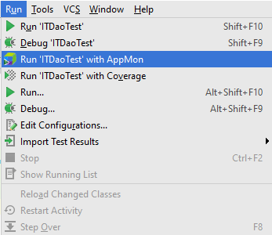
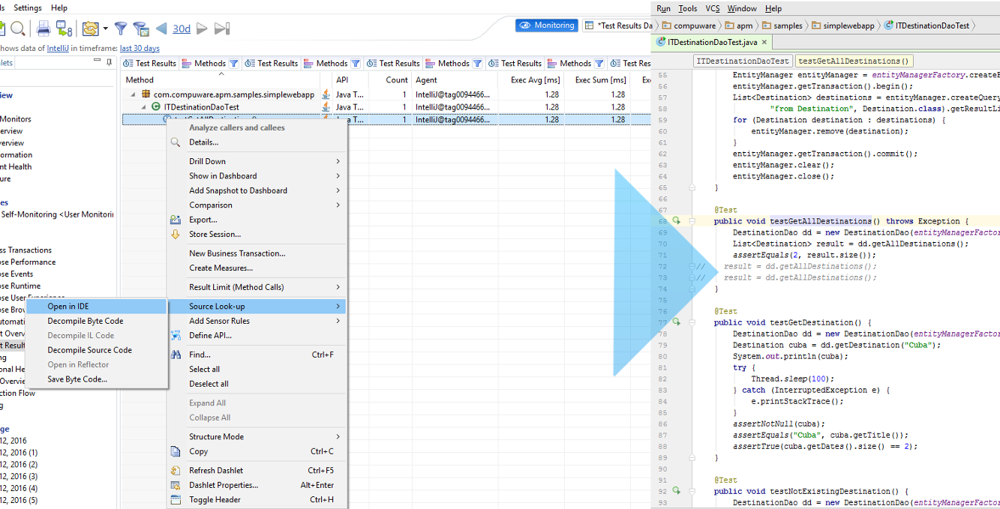

# Dynatrace IntelliJ Idea Integration Plugin  
 
The Dynatrace IntelliJ Idea Integration Plugin enables you to:
* launch applications with an injected Dynatrace Agent directly from IntelliJ
* retrieve & display the key architectural metrics (such as number of SQL queries, external API calls, exceptions and log messages) from your tests
* perform look-ups of sources files and methods from applications under diagnosis in Dynatrace Application Monitoring

Special thanks to Christian Grimm who contributed to the first version of this plugin.

* Download latest release: https://github.com/Dynatrace/Dynatrace-IntelliJ-IDEA-Integration-Plugin/releases/tag/v2.0.1
* IntelliJ IDEA Plugin on the Dynatrace Community: https://community.dynatrace.com/community/display/DL/IntelliJ+IDEA+Integration+Plugin

#### Table of Contents

* [Installation](#installation)  
 * [Prerequisites](#prerequisites)
 * [Installation from JetBrains repository](#repository_installation)
 * [Manual Installation](#manual_installation)
* [Configuration](#configuration)
 * [Global Settings](#global)
 * [Run Configurations](#run_configurations)
* [Use the Intellij Idea Integration Plugin](#use)
 * [Launcher](#launcher)
 * [Test Result](#test_result)
 * [Source Code Look-up](#source_code)
*  [Problems? Questions? Suggestions?](#feedback)
* [Additional Resources](#resources)
  * [Dynatrace AppMon Documentation](#doc)
  * [Blogs](#blogs)

## Installation

### Prerequisites

* Dynatrace Application Monitoring version: 6.3+
* IntelliJ version: 2016.1+ (145+)

Find further information in the [Dynatrace community](https://community.dynatrace.com/community/pages/viewpage.action?pageId=68649064).

### Installation from JetBrains repository

* In IntelliJ IDEA, click on *File / Settings / Plugin / Browse repositories...*
* In the search box type *Dynatrace* and select *Dynatrace AppMon Integration*
* Click *Install* and restart IDEA

### Manual Installation

* Download the [latest plugin]()
* In IntelliJ Idea, click on *File / Settings / Plugins / Install plugin from disk...*
* Select the downloaded zip archive 

## Configuration

### Global Settings

The global settings for the plugin are located under *File / Settings / Build, Execution, Deployment / Dynatrace*

### Run Configurations 

## Using the IntelliJ Idea Integration Plugin

### Launcher

The lancher will run applications with an injected Dynatrace Agent using the agent name and additional parameters defined in the run configuration:

The launcher support the following launch mode:
* NGTest
* JUnit test

The agent will output debug information into the console:

### Test Result

When lauching JUnit tests with the Dynatrace launcher, the plug-in will automatically register a test run to the Dynatrace Server. The results and key architectural metrics are automatically retrieved and displayed in the *Test Result* tab.

 

The test results are also visible in the Dynatrace Client for further drill-down to the PurePath level.

 

### Source Code Look-up

The Dynatrace Client enables you to analyze PurePaths down to the individual methods that have been instrumented in the context of the captured transaction. When you identify a problematic method either in the PurePath view or in the Methods view of the Dynatrace Client, you can use the Source Code Lookup to jump to the source code line if you have the IntelliJ Idea project open.

 

## Problems? Questions? Suggestions?

* [IntelliJ Integration Plugin FAQ / Troubleshooting Guide](FAQ.md)
* Post any problems, questions or suggestions to the Dynatrace Community's [Application Monitoring & UEM Forum](https://answers.dynatrace.com/spaces/146/index.html).

## Additional Resources

### Dynatrace AppMon Documentation

- [Continuous Delivery & Test Automation](https://community.dynatrace.com/community/pages/viewpage.action?pageId=215161284)
- [Capture Performance Data from Tests](https://community.dynatrace.com/community/display/DOCDT63/Capture+Performance+Data+from+Tests)
- [Integrate Dynatrace in Continous Integration Builds](https://community.dynatrace.com/community/display/DOCDT63/Integrate+Dynatrace+in+Continuous+Integration+Builds)

### Recorded Webinar

- [Online Perf Clinic - Metrics-Driven Continuous Delivery with Dynatrace Test Automation](https://youtu.be/TXPSDpy7unw)

### Blogs

- [Continuous Performance Validation in Continuous Integration Environments](http://apmblog.dynatrace.com/2013/11/27/continuous-performance-validation-in-continuous-integration-environments/)
- [Software Quality Metrics for your Continuous Delivery Pipeline – Part I](http://apmblog.dynatrace.com/2014/03/13/software-quality-metrics-for-your-continuous-delivery-pipeline-part-i/)
- [Software Quality Metrics for your Continuous Delivery Pipeline – Part II: Database](http://apmblog.dynatrace.com/2014/04/23/database-access-quality-metrics-for-your-continuous-delivery-pipeline/)
- [Software Quality Metrics for your Continuous Delivery Pipeline – Part III – Logging](http://apmblog.dynatrace.com/2014/06/17/software-quality-metrics-for-your-continuous-delivery-pipeline-part-iii-logging/)

